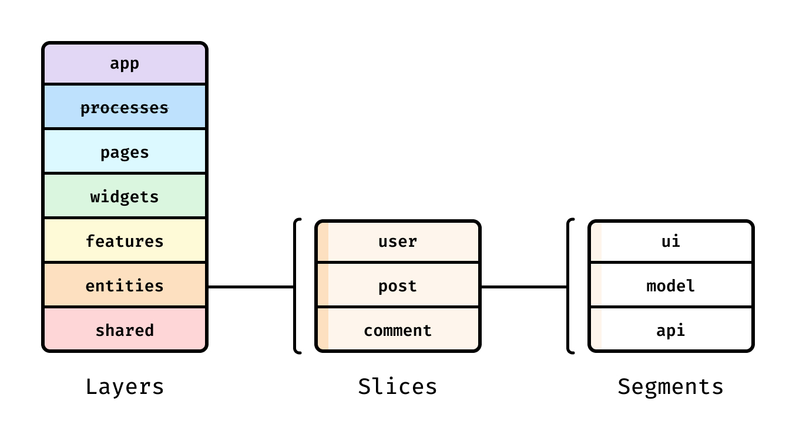

## 개요
회사 프로젝트를 진행하면서, 규모가 커질수록 유지보수성과 확장성, 협업 효율성에 대한 고민이 있었습니다.  
상위 폴더 구조외에 명확한 설계 기준이 없는 상태에서 기능이 계속 추가되다 보니 전체 구조를 파악할 때 어려웠고, 직접 작업할 때도 어디에 위치하여 어떤 구조로 진행하는 것이 좋을지 고민하는 시간도 있었습니다.  
해당 문서는 기존 구조의 한계를 돌아보며, 확장성 및 유지보수성을 높이기 위한 `Feature-Sliced-Design (FSD)` 아키텍처를 정리해보고자 합니다.

## FSD 아키텍처
프론트엔드 애플리케이션 구조를 위한 아키텍처 방법론입니다.  
코드를 어떻게 분리하고 구성할지를 명확히 정의하여, 변화하는 비즈니스 요구 속에서 프로젝트를 이해하기 쉽고 안정적으로 유지할 수 있도록하고, 코드의 책임을 분리하여 쉽게 유지보수 및 접근할 수 있는 것을 목표로 합니다.  

제가 생각한 FSD 의 철학은 아래와 같습니다.
- UI 가 아닌 **비즈니스 기능 중심으로 구조를 설계**한다.
- **기능 단위로 코드를 캡슐화**하여 **의존성을 명확히 관리**한다.
- 프로젝트가 커질수록 **구조적 이점이 커지도록 설계**한다.  


이를 위해 FSD 는 `Layer → Slice → Segment` 로 이어지는 명확한 계층 구조를 정의합니다.

| 구분                  | 역할                                   | 특징 및 규칙                                                                                                    |
| ------------------- | ------------------------------------ | ---------------------------------------------------------------------------------------------------------- |
| **레이어 (Layers)**    | 코드의 재사용 범위와 의존성 규칙에 따라 수직적으로 구분한 구조  | 상위 레이어는 하위 레이어만 참조할 수 있는 **단방향 의존성**을 가집니다. <br />(`app → pages → widgets → features → entities → shared`) |
| **슬라이스 (Slices)**   | 하나의 레이어 안에서 코드를 **비즈니스 도메인 기준**으로 분리 | 같은 레이어 내에서는 다른 슬라이스를 직접 참조하지 않습니다. <br />이를 통해 **높은 응집도와 낮은 결합도**를 유지합니다.                                  |
| **세그먼트 (Segments)** | 슬라이스 내부에서 코드를 **기술적 목적**에 따라 구분      | `ui`, `api`, `model` 등 **역할이 명확한 이름**을 사용합니다. <br />`components`, `hooks`처럼 범용적인 이름은 지양합니다.                |

## 1️⃣ Layers (레이어)
레이어는  FSD 구조의 최상위 계층으로, React 기준 `src` 디렉터리 하위에 위치합니다.  
레이어는 역할에 따라 명확히 구분되며, 표준적으로 다음과 같은 종류를 가집니다.

| 구분            | 설명                                             | 특이사항                                                                             |
| ------------- | ---------------------------------------------- | -------------------------------------------------------------------------------- |
| **App**       | 애플리케이션 전반에 영향을 주는 설정과 초기화 코드                   | 라우터 설정, 진입점, 전역 상태 관리, 전역 스타일, 각종 Provider 등을 포함하며 **slice 없이 segment로만 구성**됩니다. |
| **Processes** | 페이지 간 흐름을 포함하는 복잡한 사용자 시나리오                    | 현재는 **더 이상 사용되지 않는 레이어**입니다.                                                     |
| **Pages**     | 전체 페이지 단위 또는 중첩 라우팅에서의 주요 화면 구성                | 일반적으로 **페이지 1개당 슬라이스 1개**를 사용하며, 유사한 페이지는 하나의 슬라이스로 묶을 수 있습니다.                   |
| **Widgets**   | 독립적으로 동작하며 여러 페이지에서 재사용 가능한 비교적 큰 단위의 기능 또는 UI | 보통 **하나의 완결된 기능 단위**를 담당합니다.                                                     |
| **Features**  | 제품 전반에서 재사용되는 기능 구현으로, 사용자에게 직접적인 비즈니스 가치를 제공  | 클릭, 결제, 신청 등 **동사적 개념**의 기능을 담당합니다.                                              |
| **Entities**  | 프로젝트에서 다루는 핵심 비즈니스 데이터와 그와 관련된 로직              | 사용자, 주문, 상품 등 **명사적 개념**을 표현합니다.                                                 |
| **Shared**    | 여러 레이어에서 공통으로 사용하는 기본 구성 요소 모음                 | 프로젝트나 비즈니스와 강하게 결합되지 않은 재사용 코드가 중심이며, **slice 없이 segment로만 구성**됩니다.              |

⚠️ `processes 레이어`는 현재 deprecated 되었으며, 신규 프로젝트에서는 사용하지 않는 것이 권장됩니다.

### 의존성 규칙

**상위 레이어는 하위 레이어만 참조**할 수 있습니다.  
예를 들어 `pages`는 features, entities, shared를 참조할 수 있지만, 그 반대는 허용되지 않습니다.  
이러한 규칙은 **의존성 흐름을 단방향으로 유지하여 코드 복잡도를 줄이고**, 구조적 **안정성을 높여**줍니다.

**※ 참고 문서**  
[React Query와 함께 사용하기](https://feature-sliced.design/kr/docs/guides/tech/with-react-query)  
[NextJS와 함께 사용하기](https://feature-sliced.design/kr/docs/guides/tech/with-nextjs)  
[Electron와 함께 사용하기](https://feature-sliced.design/kr/docs/guides/tech/with-electron)

## 2️⃣ Slice (슬라이스)
슬라이스는 레이어 하위에 위치하는 두 번째 계층으로, **기능 단위의 묶음**을 의미합니다.  
**슬라이스의 이름은 표준화되어 있지 않으며**, 프로젝트의 비즈니스 도메인에 따라 **자유롭게 정의**할 수 있습니다.  

⭐ `app`과 `shared 레이어`는 **슬라이스를 가지지 않고, 바로 세그먼트로 구성**됩니다.

⭐ 모든 슬라이스는 반드시 **엔트리 포인트**를 가져야합니다.  
- 슬라이스 내부 파일을 직접 import 할 수 없습니다.
- 반드시 `index.ts`와 같은 **엔트리 포인트를 통해 접근 가능**합니다.

이를 통해 슬라이스 내부 구현을 외부로부터 숨기고, 필요한 인터페이스만 노출할 수 있습니다.  
결과적으로 모듈 간 결합도가 낮아지고, 변경에 강한 구조를 만들 수 있게 됩니다.

## 3️⃣ Segment (세그먼트)
세그먼트는 **슬라이스 내부에서 역할에 따라 코드를 분리하는 마지막 계층**입니다.  
일반적으로 다음과 같은 세그먼트 구성이 많이 사용됩니다.

| 네이밍        | 설명                             | 예시                                                                           |
| ---------- | ------------------------------ | ---------------------------------------------------------------------------- |
| **ui**     | 화면 표시와 사용자 인터페이스에 관련된 코드       | UI 컴포넌트, 스타일, 날짜 포맷터 등                                                       |
| **api**    | 백엔드와의 통신 및 데이터 처리 로직           | request 함수, API 타입, mapper 등                                                 |
| **model/store**  | 애플리케이션의 도메인 모델과 상태 관리 로직       | 스키마, 인터페이스, 스토어, 비즈니스 로직<br />(Redux / Zustand의 action, reducer, selector 등) |
| **types**  | 해당 슬라이스에서 사용하는 **타입 정의 전용 코드** | DTO, API 응답 타입, Props 타입 등                                                   |
| **lib**    | 해당 슬라이스 내부에서만 사용하는 공통 유틸리티     | 헬퍼 함수, 내부 전용 유틸 코드                                                           |
| **config** | 기능과 관련된 설정 값 및 feature flag    | 환경별 설정, 플래그 정의 파일 등                                                          |

## 장점
- **일관성 있는 프로젝트 구조**  
  표준화된 구조를 제공하여, 프로젝트 규모가 커지더라도 전체 구조를 예측하기 쉽습니다.

- **유지보수성과 확장성 향상**  
  기능 단위로 코드가 분리되어 있어 특정 기능을 수정하더라도 다른 영역에 미치는 영향이 적고, 새로운 기능 추가 역시 비교적 수월합니다.

- **협업 효율성**  
  각 기능이 독립적으로 구성되어 있어 팀원 간 작업 충돌을 최소화할 수 있습니다.

- **비즈니스 중심 설계**  
  UI가 아닌 기능을 중심으로 구조를 설계하기 때문에, 요구사항 변경 시 관련 기능을 빠르게 찾아 수정할 수 있습니다.

## 단점

- **오버 엔지니어링의 가능성**  
  규모가 작거나 단순한 서비스에서는 구조가 과도하게 느껴질 수 있습니다.

- **초기 학습 비용**  
  개념과 규칙이 명확한 만큼, 팀이 익숙해지기까지 일정한 학습 시간이 필요합니다.

- **팀 내 합의의 중요성**  
  FSD는 개인보다는 팀 단위에서 효과가 커지므로, 공통된 규칙과 컨벤션을 지속적으로 유지하는 것이 중요합니다.


## 📌 비교하기

`React` 기반으로 프로젝트를 진행하다 보면, 보통 아래와 같은 폴더 구조를 사용하게 됩니다.
```
src/
 ├─ apis
 ├─ components
 ├─ pages
 ├─ mocks
 ├─ constants
 ├─ hooks
 ├─ styles
 ...
```

이 구조에서는 **코드가 무엇을 하는지**보다는,  
해당 코드가 어떤 역할이나 성격을 가지는지를 기준으로 분리하는 경우가 많습니다.


반면, `FSD`를 기준으로 프로젝트를 구성하면 다음과 같은 구조를 가지게 됩니다.  
⭐ `app`과 `shared` 레이어는 **슬라이스 없이 세그먼트로만 구성**되는 것이 특징입니다.  
```
src/
 ├─ app/
 │   ├─ providers/
 │   ├─ routes/
 │   └─ index.ts
 │
 ├─ pages/
 │   ├─ home/
 │   └─ dashboard/
 │
 ├─ widgets/
 │   ├─ header/
 │   └─ footer/
 │
 ├─ features/
 │   ├─ auth/
 │   │   ├─ ui/
 │   │   ├─ api/
 │   │   ├─ model/
 │   │   └─ types/
 │   │
 │   └─ ...
 │
 ├─ entities/
 │   ├─ user/
 │   │   ├─ model/
 │   │   └─ types/
 │   │
 │   └─ ...
 │
 └─ shared/
     ├─ ui/
     ├─ api/
     ├─ lib/
     ├─ hooks/
     ├─ styles/
     └─ index.ts

```

즉, **기존 구조가 코드의 성격을 기준으로 분리**한다면,  
FSD는 **코드가 속한 기능과 도메인을 기준으로 구조를 설계**합니다.

### 기존
```
components/SignInForm.tsx
apis/auth.ts
hooks/useSignIn.ts
types/auth.ts
modles/auth.ts
```

### FSD
```
features/
 └─ auth/
     ├─ ui/
     │   └─ SignInForm.tsx
     ├─ api/
     │   └─ signIn.ts
     ├─ hooks/
     │   └─ useSignIn.ts
     └─ types/
         └─ auth.ts

```

## 마무리
FSD는 모든 프로젝트에 반드시 적용해야 하는 정답은 아니라고 생각합니다.  
하지만 프로젝트 규모가 커질수록 구조로 인한 고민이 반복되고 있다면,  
코드를 기능과 도메인 중심으로 바라볼 수 있는 하나의 좋은 기준이 될 수 있습니다.

이번 정리를 통해 단순히 폴더 구조를 바꾸는 것이 아니라,  
**코드를 어떤 기준으로 바라보고 나눌 것인가**에 대해 다시 생각해보는 계기가 되었습니다.

앞으로는 프로젝트의 규모와 팀 상황에 맞게 FSD의 개념을 선택적으로 적용하며,  
과도한 구조보다는 문제를 해결하는 데 도움이 되는 방향으로 활용해보려고 합니다.

**※ 참고 문서**  
[FSD 공식 문서](https://feature-sliced.design/kr/docs/get-started/overview)  
[카카오 FSD 아키텍처 적용기](https://tech.kakaopay.com/post/fsd/#4-%EC%83%81%ED%96%A5%EC%8B%9D-bottom-up-%EB%B0%A9%EC%8B%9D-%EC%B1%84%ED%83%9D)